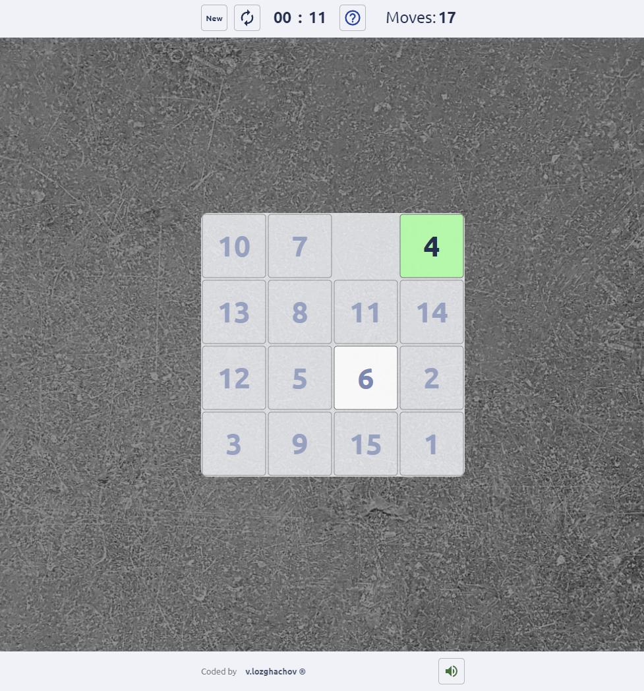

# 1️⃣5️⃣ 15 game ( the Gem Puzzle) 🧩

### 📖 Description

+ The 15 puzzle (also called Gem Puzzle, Boss Puzzle, Game of Fifteen, Mystic Square and many others) is a sliding puzzle having 15 square tiles numbered 1–15 in a frame that is 4 tiles high and 4 tiles wide, leaving one unoccupied tile position. Tiles in the same row or column of the open position can be moved by sliding them horizontally or vertically, respectively. The goal of the puzzle is to place the tiles in numerical order.
+ Good luck and enjoy!  

### 🖼 Screenshot

### 💻 [Live preview](https://thegempuzzle.netlify.app/)
### ⚙ Built with
- HTML5 markup
- CSS3
- JavaScript
## 👤 Author
- LinkedIn - [v.lozghachov](https://www.linkedin.com/in/valerii-lozghachov/)
